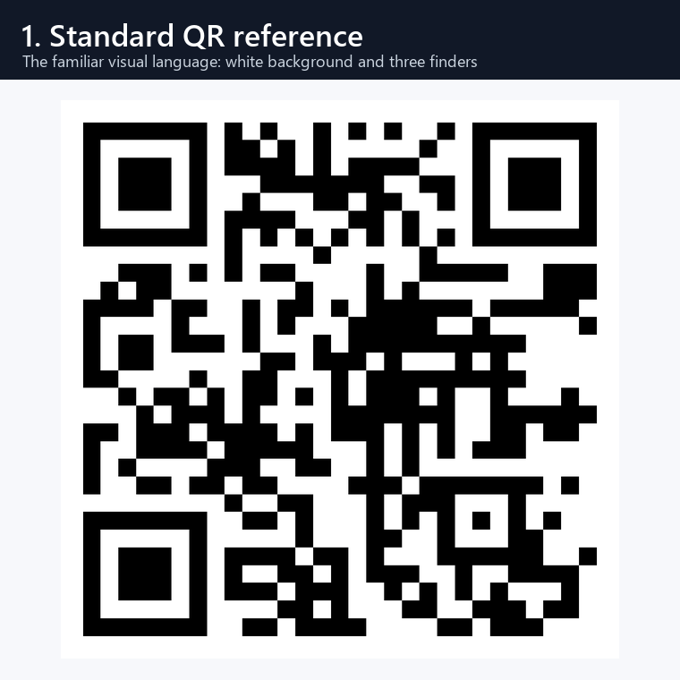
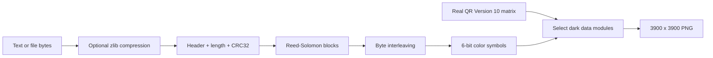
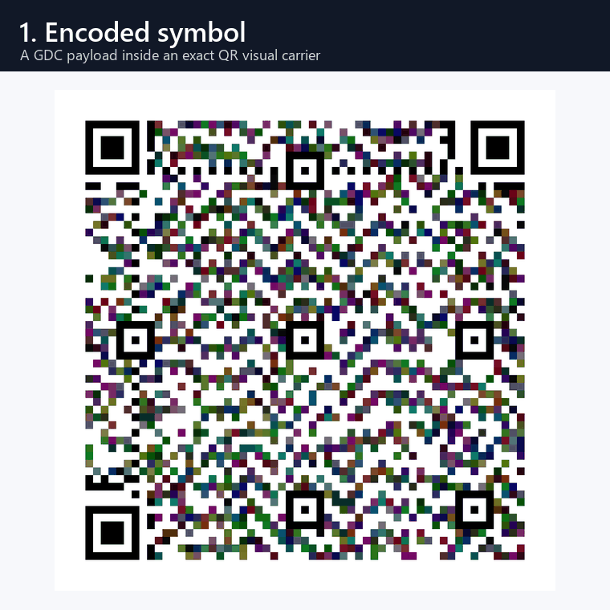

<div align="center">

# Gradient Dense Code

### QR geometry with a calibrated color-data layer

[](https://www.python.org/)
[](CHANGELOG.md)
[](test_gdc.py)
[](LICENSE)

**GDC is an experimental visual data format that preserves a real QR Code
carrier while encoding a second payload through calibrated RGB values.**



</div>

> [!IMPORTANT]
> GDC is a research prototype, not a replacement for the QR Code standard.
> A normal QR scanner reads the carrier text `GDC-V10-COLOR-CARRIER`.
> Recovering the separate color payload requires the GDC decoder.

## Contents

- [Why GDC?](#why-gdc)
- [What is GDC?](#what-is-gdc)
- [Who is it for?](#who-is-it-for)
- [How it works](#how-it-works)
- [Current v10 profile](#current-v10-profile)
- [Installation](#installation)
- [Usage](#usage)
- [Camera decoding](#camera-decoding)
- [Testing](#testing)
- [Possibilities](#possibilities)
- [Limitations](#limitations)
- [Project structure](#project-structure)
- [History](#history)
- [Author and contributing](#author-and-contributing)

## Why GDC?

Traditional QR Codes are exceptionally reliable because they use a carefully
specified binary matrix, robust finder patterns, alignment targets, masking,
and Reed-Solomon error correction. Their reliability comes with an intentional
constraint: each module is fundamentally dark or light.

GDC explores a research question:

> Can the proven visual geometry of a QR Code carry an additional calibrated
> color channel without losing its recognizable QR structure?

Earlier GDC prototypes maximized the number of colored cells. They achieved
higher theoretical density but looked like dense color mosaics and were harder
for real cameras to resolve. Version 10 reverses that priority:

1. Start with a real standards-generated QR matrix.
2. Preserve every white module as pure white.
3. Preserve every functional QR pattern in black and white.
4. Apply calibrated color only to eligible dark data modules.
5. Protect the custom color payload with compression, CRC32, interleaving, and
   Reed-Solomon correction.

The result looks and behaves like a colored QR Code first, while the GDC color
algorithm operates as a second layer.

## What is GDC?

Gradient Dense Code is a custom encoder and decoder implemented in Python.
The current format has two related but independent layers:

| Layer | Purpose | Decoder |
|---|---|---|
| QR carrier | Supplies QR geometry, visual recognition, finder patterns, timing, alignment, and masking | Standard QR scanner |
| GDC color payload | Stores custom bytes as calibrated RGB levels on dark carrier modules | `gdc_v10.py` |

The QR carrier is generated locally with the
[`qrcode`](https://pypi.org/project/qrcode/) package. The matrix contains the
text:

```text
GDC-V10-COLOR-CARRIER
```

The custom payload may contain UTF-8 text or arbitrary file bytes. It is not
the same payload exposed to a normal QR scanner.

## Who is it for?

GDC is currently aimed at:

- students and researchers studying visual coding and color quantization;
- developers experimenting with custom optical data channels;
- computer-vision projects involving calibration and perspective correction;
- printed-media experiments where QR recognition and a private secondary
  payload are both useful;
- contributors interested in error correction, color science, and camera
  robustness.

The project was created by **Adhrit Verma**. The original concept dates to
March 2025 and proposed using calibrated color values to extend binary visual
codes.

It is not currently intended for safety-critical, medical, financial, identity,
or archival use.

## How it works

### Encoding pipeline



1. The payload is compressed when compression makes it smaller.
2. A protected header stores the GDC version, flags, original length, stored
   length, and CRC32.
3. Reed-Solomon parity is added in independent blocks.
4. Encoded bytes are interleaved so localized damage is distributed across
   multiple correction blocks.
5. Each six-bit symbol becomes three two-bit channel indexes: red, green, and
   blue.
6. The indexes select one of four calibrated dark values per channel.
7. Values are written only into eligible dark modules of the QR carrier.
8. White modules and QR functional patterns remain unchanged.

### Decoding pipeline

```mermaid
flowchart LR
    A[PNG or camera photo] --> B[Locate three QR finders]
    B --> C[Estimate affine geometry]
    C --> D[Locate alignment pattern]
    D --> E[Perspective correction]
    E --> F[Sample module centers]
    F --> G[Read hidden calibration samples]
    G --> H[Recover RGB symbols]
    H --> I[Deinterleave + Reed-Solomon]
    I --> J[CRC32 validation + decompression]
    J --> K[Original payload]
```



The camera decoder first uses the three large QR finder patterns. It then uses
a QR alignment target as the fourth geometric reference, rectifies the image,
samples module centers, reconstructs calibrated color symbols, corrects
recoverable damage, and verifies the final bytes with CRC32.



## Current v10 profile

| Property | Value |
|---|---:|
| GDC format version | 10 |
| QR carrier version | 10 |
| Logical matrix | 57 × 57 modules |
| Quiet zone | 4 modules |
| Rendered module size | 60 × 60 pixels |
| Generated PNG | 3900 × 3900 pixels |
| Color levels | 4 per RGB channel |
| Raw symbol width | 6 bits |
| Reed-Solomon profile | RS(255, 223) |
| Parity | 32 bytes per block |
| Protected incompressible payload | 875 bytes |
| Standard QR carrier text | `GDC-V10-COLOR-CARRIER` |

Compressible text can exceed the 875-byte incompressible limit because GDC
applies zlib compression before capacity is checked.

### Why the protected capacity is modest

Version 10 intentionally spends modules on:

- exact QR visual compatibility;
- pure-white background modules;
- standard QR functional structures;
- hidden calibration samples;
- strong Reed-Solomon parity;
- large camera-readable modules.

This is a deliberate reliability and appearance tradeoff. Increasing capacity
again should be treated as a separate profile, not achieved by silently making
the default modules too small.

## Installation

### Requirements

- Python 3.12 or newer
- a virtual environment is recommended

### Windows PowerShell

```powershell
git clone https://github.com/Adhrit-Verma/GDC.git
cd GDC

python -m venv .venv
.\.venv\Scripts\Activate.ps1
python -m pip install -r requirements.txt
```

### Linux or macOS

```bash
git clone https://github.com/Adhrit-Verma/GDC.git
cd GDC

python3 -m venv .venv
source .venv/bin/activate
python -m pip install -r requirements.txt
```

## Usage

Run the interactive application:

```bash
python gdc_v10.py
```

The menu supports:

1. encoding text;
2. encoding a file;
3. decoding an exact GDC PNG;
4. decoding a camera photo;
5. displaying the active profile and capacity.

### Python API example

```python
from pathlib import Path

import gdc_v10 as gdc

payload = b"Hello from Gradient Dense Code"

stream = gdc.build_stream(payload)
image, *_ = gdc.stream_to_image(stream)
image.save("hello-gdc.png")

decoded = gdc.image_to_payload(Path("hello-gdc.png"))
assert decoded == payload
```

### Encode with the convenience function

```python
import gdc_v10 as gdc

result = gdc.encode_payload(
    b"Camera-readable color payload",
    "camera-payload.png",
)

print(result["stored_bytes"])
print(result["compressed"])
```

## Camera decoding

For best results:

- keep all three finder patterns visible;
- keep the full four-module white border visible;
- avoid glare and hard reflections;
- capture the symbol as square-on as practical;
- do not apply aggressive beauty filters or color effects;
- use a matte print surface when possible;
- print large enough to preserve module boundaries.

At a physical width of 3 inches, the 65-module image including quiet zone
provides modules of approximately **1.17 mm**. At 4 inches, modules are
approximately **1.56 mm**.

Decode a photo interactively through menu option 4, or directly:

```python
from pathlib import Path

import gdc_v10 as gdc

payload = gdc.photo_to_payload(Path("phone-photo.jpg"))
print(payload)
```

## Testing

Run the complete test suite:

```bash
python -m unittest -v test_gdc.py
```

The suite currently verifies:

- exact PNG round trips;
- compression beyond the incompressible capacity;
- Reed-Solomon recovery after interleaved damage;
- preservation of the exact QR carrier matrix;
- pure-white carrier background modules;
- successful decoding by a standard OpenCV QR scanner;
- perspective and JPEG camera simulation;
- downsampled, blurred, and brightness-shifted camera input.

Regenerate the README animations from the actual encoder:

```bash
python -m tools.make_readme_assets
```

## Possibilities

GDC is a foundation for experiments rather than a finished standard. Useful
future directions include:

### Multiple profiles

- **Field profile:** large modules, four levels per channel, stronger ECC.
- **Document profile:** more modules and higher capacity for controlled scans.
- **Screen profile:** denser color levels for display-to-camera transfer.

### Better color science

- decode in CIE Lab instead of raw RGB;
- use printer-specific calibration charts;
- compensate for paper color and ambient illumination;
- choose colors by perceptual distance rather than equal RGB spacing.

### Adaptive reliability

- detect uncertain modules and pass erasure positions to Reed-Solomon;
- choose ECC strength based on payload size;
- repeat critical headers across independent matrix regions;
- use confidence maps from the camera decoder.

### Security and authenticity

- optional payload encryption;
- digital signatures for tamper detection;
- signed public metadata in the QR carrier;
- private GDC payloads readable only by authorized applications.

### Practical applications

- product packaging with a public QR link and private offline metadata;
- event tickets with visible compatibility plus a custom verification layer;
- educational demonstrations of optical coding and error correction;
- compact configuration exchange between offline devices;
- provenance labels and signed manufacturing records.

These are possibilities, not claims of current production readiness.

## Limitations

- GDC is not an ISO-standard barcode format.
- A standard QR scanner reads only the fixed carrier text, not the GDC payload.
- The current protected incompressible payload is 875 bytes.
- Printed color varies significantly by printer, ink, paper, lighting, and
  camera processing.
- Real-world testing across multiple phones and printers is still required.
- GDC v10 does not decode earlier GDC wire formats.
- The QR carrier is visually and scanner compatible, but modifying its dark
  colors may reduce compatibility with some low-quality QR scanners.
- Generated symbols should not be used as the only copy of important data.

## Project structure

```text
GDC/
├── gdc_v10.py                 # Encoder, exact decoder, and camera decoder
├── test_gdc.py                # Regression and camera-simulation tests
├── requirements.txt           # Runtime dependencies
├── CHANGELOG.md               # Known history from v1 through v10
├── LICENSE                    # Apache License 2.0
├── references/
│   ├── qr_reference.png       # Downloaded real QR visual reference
│   └── README.md              # Reference provenance
├── assets/readme/
│   ├── qr-to-gdc.gif          # README concept animation
│   └── camera-recovery.gif    # README camera workflow animation
└── tools/
    └── make_readme_assets.py  # Reproducible GIF generator
```

## History

GDC began as a color-gradient dense-code concept and evolved through several
competing priorities:

- early versions explored maximum color density;
- v6 introduced the first surviving fixed-grid calibrated implementation;
- v7 added compression, Reed-Solomon correction, and interleaving;
- v8 and v9 increased module size for camera use;
- v10 adopted a real QR carrier and applied GDC color only to dark modules.

See [CHANGELOG.md](CHANGELOG.md) for the version-by-version record.

## Author and contributing

**Creator:** Adhrit Verma

Contributions are welcome, particularly in:

- controlled print-and-camera benchmark datasets;
- color calibration and perceptual quantization;
- error-correction and erasure decoding;
- QR compatibility testing across scanner applications;
- documentation, packaging, and command-line ergonomics.

Before submitting a change:

1. keep the QR carrier invariant intact;
2. add or update tests for format changes;
3. update `CHANGELOG.md` when the wire format changes;
4. regenerate README assets if visuals change;
5. run the full unit-test suite.

## License

Licensed under the [Apache License 2.0](LICENSE).

---

<div align="center">

**GDC v10 — QR first, color data second.**

</div>
