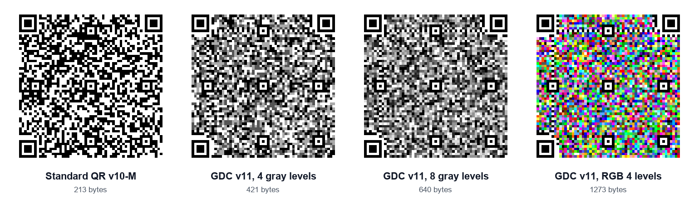
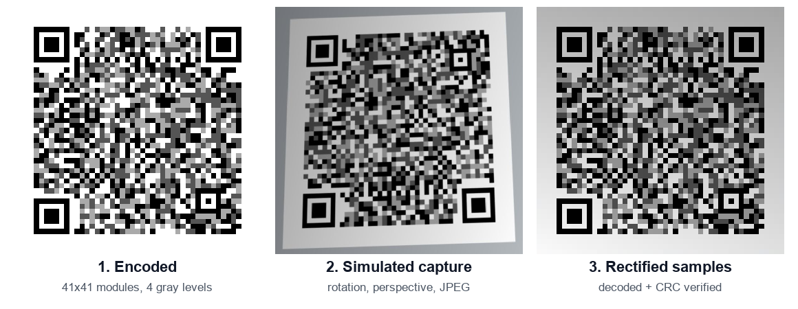

<div align="center">

# Gradient Dense Code

### A QR code whose modules hold levels, not bits

[](https://www.python.org/)
[](CHANGELOG.md)
[](test_gdc.py)



</div>

A QR code stores one bit per module: black or white. **GDC stores 2 to 4 bits
per module** by printing each data module at one of 4, 8 or 16 gray levels
(or RGB levels). Everything else is standard QR geometry: finder patterns,
separators, timing lines, alignment patterns, format/version areas and the
quiet zone. The symbol looks and frames like the QR codes you scan every day,
and it carries 2–3× the data in the same area.

> [!NOTE]
> GDC is a research format with its own decoder (`gdc.py`). A phone's QR app
> recognizes the shape (OpenCV's QR detector locates it) but cannot read the
> multilevel payload.

## Capacity

Incompressible bytes at error-correction level M, compared with a standard QR
code of the same version (binary mode). Compressible text goes further,
because GDC applies zlib automatically when it helps.

| Version | Modules | QR | GDC 4 gray | GDC 8 gray | GDC 16 gray | GDC RGB 4 |
|---:|---:|---:|---:|---:|---:|---:|
| 1 | 21×21 | 14 | 27 | 43 | 59 | 91 |
| 5 | 37×37 | 84 | 163 | 247 | 328 | 499 |
| 10 | 57×57 | 213 | 421 | 640 | 847 | 1,273 |
| 20 | 97×97 | 666 | 1,336 | 1,997 | 2,677 | 3,999 |
| 30 | 137×137 | 1,370 | 2,695 | 4,051 | 5,420 | 8,107 |
| 40 | 177×177 | 2,331 | 4,585 | 6,859 | 9,140 | 13,723 |

The largest QR code (40-L) holds 2,953 bytes. GDC 40-L holds 5,905 bytes with
4 gray levels and 8,883 with 8. Print `python gdc.py capacity --levels 8`
for any profile.

## How it works

**Encode:** payload → zlib (if smaller) → 5-byte header (format, length,
CRC-16) → Reed-Solomon blocks, with parity shares matching QR's L/M/Q/H →
byte interleaving → whitening → Gray-coded levels, written in QR's two-column
zigzag order. The profile (levels, gray/RGB, ECC) is BCH-coded into the
standard format-information modules, so the decoder needs no settings.

**Decode:**

1. Find the three finders (ring → hole → core contour hierarchy).
2. Estimate the version and fit an affine transform.
3. Refine it by searching alignment patterns, working outward from the
   finders. The mapping is a homography plus a moving-least-squares residual
   field, which absorbs mild lens distortion and paper curl.
4. Sample the module centers.
5. Correct uneven lighting with black/white surfaces fitted to the known
   function modules.
6. Cluster levels per channel with 1-D k-means, which absorbs printer and
   camera tone curves.
7. Cancel blur bleed from neighboring modules by decision feedback.
8. Reed-Solomon decode and CRC check.



## Robustness

`python -m tools.benchmark` simulates a print-and-phone capture. It applies a
reduced ink/paper range, a gamma of 1.6, a warm color cast, perspective, blur,
shading, JPEG at quality 70 and sensor noise, then reports the symbol error
rate for version 10 (65 modules wide including the quiet zone):

| Profile | 5.8 px/module | 8.5 px/module | 12 px/module |
|---|---|---|---|
| 4 gray, M | ✅ 0.0% | ✅ 0.0% | ✅ 0.0% |
| 8 gray, M | ✅ 0.6–3.1% | ✅ ≤0.2% | ✅ 0.0% |
| 16 gray, L | ❌ 25–35% | ⚠️ 0.6–5.9% | ✅ ≤2.1% |
| RGB 4, M | ❌ ~10% | ✅ <1% | ✅ 0.0% |

**4 gray levels is the everyday default.** 8 gray levels suits good prints
and screens. 16 levels and RGB need sharp, high-resolution captures, and JPEG
chroma subsampling hurts RGB in particular. These results come from
simulation; real printer and phone testing is the next step.

## Usage

```bash
python -m pip install -r requirements.txt

python gdc.py encode hello.png --text "Hello from GDC"          # smallest version that fits
python gdc.py encode doc.png --file notes.txt --levels 8 --ecc Q
python gdc.py decode hello.png                                   # PNG or camera photo
python gdc.py decode photo.jpg --output recovered.bin
python gdc.py capacity --levels 4 --mode rgb
```

```python
import gdc

image = gdc.encode(b"payload", levels=4, mode="gray", ecc="M")  # PIL image
image.save("code.png")
assert gdc.decode("code.png") == b"payload"                    # path, PIL image or BGR array
```

For printing, use `--module-px` large enough for your printer and print at
least 1 mm per module. Matte paper avoids glare.

## Testing

```bash
python -m unittest -v test_gdc
```

The tests cover exact round trips across versions 1–40 at 4, 8 and 16 levels
in gray and RGB, and density versus QR at every version and ECC level. They also run
simulated camera captures at all four rotations and perspective, decode
version 40 under 1% lens barrel distortion, decode a
code with a 6×6-module patch covered, and check that OpenCV's standard QR
detector recognizes the symbol.

## Limitations and next steps

- Only the GDC decoder reads the payload. Phone QR apps don't.
- Real print and camera validation across printers, papers and phones is
  still needed. Please contribute photos.
- Versions above 25 tolerate about 1% barrel distortion when the code fills
  the frame. Framing the code smaller in the shot keeps it within that.
- Ideas: a live webcam scanner,
  perceptually spaced levels, CIELAB decoding for RGB.

## Files

```text
gdc.py                      format, encoder, decoder, CLI
test_gdc.py                 test suite and camera simulator
tools/benchmark.py          robustness sweep
tools/make_readme_assets.py regenerates assets/readme/
CHANGELOG.md                format history (v1–v11)
```

Created by **Adhrit Verma**. The concept (March 2025) was to extend binary
visual codes with calibrated gradient values; v11 is that idea on standard
QR geometry.
